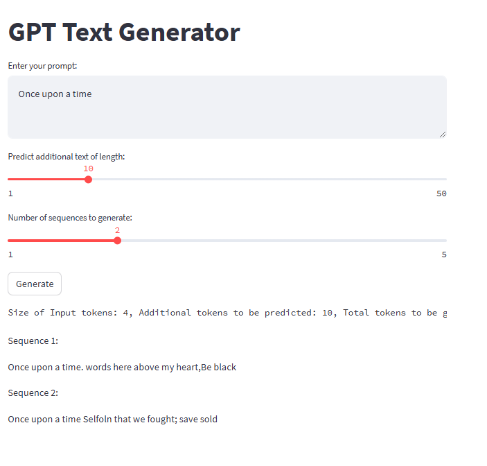
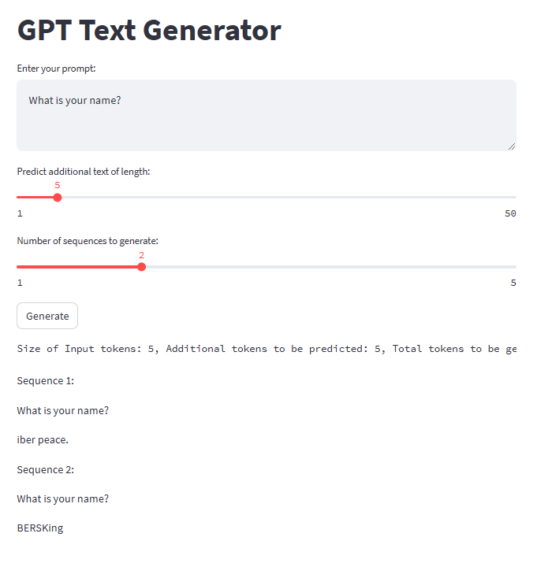
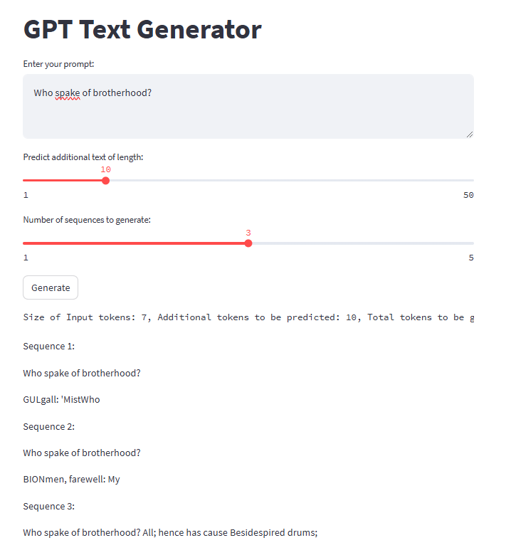

# GPT Text Generator

A lightweight GPT implementation for text generation, optimized for deployment on Hugging Face Spaces. This model is based on the GPT architecture with approximately 124M parameters.

## Model Architecture
### Configuration

- `block_size`: int = 512 # Context window size
- `vocab_size`: int = 50257 # GPT-2 vocabulary size
- `n_layer`: int = 12 # Number of transformer layers
- `n_head`: int = 12 # Number of attention heads
- `n_embd`: int = 768 # Embedding dimension
- `dropout`: float = 0.1 # Dropout rate
- `Total Parameters`: ~124M (optimized for performance and deployment size)

## Training the Model

1. **Setup Environment**
```bash
pip install torch tiktoken transformers
```

2. **Prepare Training Data**
- Create `input.txt` in the root directory
- Add your training text data

3. **Train on Local Machine**
```bash
python src/train.py
```

4. **Train on Google Colab** (Recommended for GPU acceleration)
- Upload project files to Colab
- Mount Google Drive (optional, for saving model)
- Run training with GPU runtime
- Download the trained `model.pt` file

### Training Parameters
- Epochs: 200 (with early stopping)
- Batch Size: 8
- Sequence Length: 128
- Learning Rate: 1e-4 with cosine annealing
- Weight Decay: 0.1
- Target Loss: < 0.1

The model automatically saves:
- Best model when loss improves
- Checkpoints every 20 epochs
- All saves use half-precision for efficiency

## Using the Model

### Local Testing
```bash
streamlit run app.py
```

### Hugging Face Spaces Deployment

1. **Create Space**
- Go to [Hugging Face Spaces](https://huggingface.co/spaces)
- Create New Space
- Select Streamlit as SDK

2. **Upload Files**
Required files:

```
README.md
├── app.py
├── model.pt # Your trained model
├── requirements.txt
├── README.md
└── src/
├── config/
├── models/
├── data/
└── utils/
```

3. **Access Your App**
- Visit your Space URL
- Enter prompt text
- Adjust generation parameters:
  - Additional tokens (1-50)
  - Number of sequences (1-5)

## Features

### Text Generation
- Context-aware text completion
- Multiple sequence generation
- Controllable generation length
- Preserves input prompt in output

### Technical Features
- Half-precision storage
- GPU/CPU compatibility
- Streamlit interface
- Token count display

## Limitations
- Maximum context: 512 tokens
- Maximum generation: 50 tokens per request
- Model size: < 300MB (for Spaces deployment)

## Requirements
```
streamlit
torch>=1.13.0
tiktoken
transformers
```

## License
MIT License

## Acknowledgments
Based on the GPT architecture and optimized for practical deployment on Hugging Face Spaces.

# Model Training Logs from Google Colab

```
# Check GPU availability
!nvidia-smi

Tue Jan 14 06:21:01 2025       
+---------------------------------------------------------------------------------------+
| NVIDIA-SMI 535.104.05             Driver Version: 535.104.05   CUDA Version: 12.2     |
|-----------------------------------------+----------------------+----------------------+
| GPU  Name                 Persistence-M | Bus-Id        Disp.A | Volatile Uncorr. ECC |
| Fan  Temp   Perf          Pwr:Usage/Cap |         Memory-Usage | GPU-Util  Compute M. |
|                                         |                      |               MIG M. |
|=========================================+======================+======================|
|   0  Tesla T4                       Off | 00000000:00:04.0 Off |                    0 |
| N/A   60C    P8              10W /  70W |      0MiB / 15360MiB |      0%      Default |
|                                         |                      |                  N/A |
+-----------------------------------------+----------------------+----------------------+
                                                                                         
+---------------------------------------------------------------------------------------+
| Processes:                                                                            |
|  GPU   GI   CI        PID   Type   Process name                            GPU Memory |
|        ID   ID                                                             Usage      |
|=======================================================================================|
|  No running processes found                                                           |
+---------------------------------------------------------------------------------------+


!python src/train.py
Using device: cuda

Model Architecture:
==================================================
Block Size (Context Length): 512
Vocabulary Size: 50257
Number of Layers: 12
Number of Heads: 12
Embedding Dimension: 768
Dropout: 0.1

Parameter Counts:
--------------------------------------------------
Token Embeddings: 38,597,376
Position Embeddings: 393,216
Per Layer: 7,077,888
All Layers: 84,934,656
Total Trainable Parameters: 124,046,592

Estimated Model Size:
Full Precision (MB): 473.20
Half Precision (MB): 236.60
==================================================

loaded 338025 tokens
1 epoch = 330 batches
Epoch 0, Loss: 6.760734
Model saved to model.pt
Epoch 1, Loss: 5.679834
Model saved to model.pt
Epoch 2, Loss: 5.503538
Model saved to model.pt
Epoch 3, Loss: 5.019493
Model saved to model.pt
Epoch 4, Loss: 4.857695
Model saved to model.pt
Epoch 5, Loss: 4.816323
Model saved to model.pt
Epoch 6, Loss: 4.515646
Model saved to model.pt
Epoch 7, Loss: 4.418112
Model saved to model.pt
Epoch 8, Loss: 4.404018
Model saved to model.pt
Epoch 9, Loss: 4.235980
Model saved to model.pt
Epoch 10, Loss: 4.035285
Model saved to model.pt
Epoch 11, Loss: 4.014054
Model saved to model.pt
Epoch 12, Loss: 4.011894
Model saved to model.pt
Epoch 13, Loss: 3.748628
Model saved to model.pt
Epoch 14, Loss: 3.745313
Model saved to model.pt
Epoch 15, Loss: 3.713518
Model saved to model.pt
Epoch 16, Loss: 3.485046
Model saved to model.pt
Epoch 17, Loss: 3.395360
Model saved to model.pt
Epoch 18, Loss: 3.426389
Epoch 19, Loss: 3.198616
Model saved to model.pt
Model saved to model.pt
Epoch 20, Loss: 3.043802
Model saved to model.pt
Epoch 21, Loss: 3.017850
Model saved to model.pt
Epoch 22, Loss: 2.905728
Model saved to model.pt
Epoch 23, Loss: 2.756555
Model saved to model.pt
Epoch 24, Loss: 2.660626
Model saved to model.pt
Epoch 25, Loss: 2.621184
Model saved to model.pt
Epoch 26, Loss: 2.433279
Model saved to model.pt
Epoch 27, Loss: 2.283171
Model saved to model.pt
Epoch 28, Loss: 2.267607
Model saved to model.pt
Epoch 29, Loss: 2.114020
Model saved to model.pt
Epoch 30, Loss: 1.935801
Model saved to model.pt
Epoch 31, Loss: 1.896307
Model saved to model.pt
Epoch 32, Loss: 1.788708
Model saved to model.pt
Epoch 33, Loss: 1.642476
Model saved to model.pt
Epoch 34, Loss: 1.518997
Model saved to model.pt
Epoch 35, Loss: 1.497842
Model saved to model.pt
Epoch 36, Loss: 1.317285
Model saved to model.pt
Epoch 37, Loss: 1.198449
Model saved to model.pt
Epoch 38, Loss: 1.160379
Model saved to model.pt
Epoch 39, Loss: 1.050488
Model saved to model.pt
Model saved to model.pt
Epoch 40, Loss: 0.906473
Model saved to model.pt
Epoch 41, Loss: 0.853709
Model saved to model.pt
Epoch 42, Loss: 0.840128
Model saved to model.pt
Epoch 43, Loss: 0.679169
Model saved to model.pt
Epoch 44, Loss: 0.606824
Model saved to model.pt
Epoch 45, Loss: 0.614717
Epoch 46, Loss: 0.505752
Model saved to model.pt
Epoch 47, Loss: 0.421580
Model saved to model.pt
Epoch 48, Loss: 0.433426
Epoch 49, Loss: 0.372162
Model saved to model.pt
Epoch 50, Loss: 0.293942
Model saved to model.pt
Epoch 51, Loss: 0.292347
Model saved to model.pt
Epoch 52, Loss: 0.272237
Model saved to model.pt
Epoch 53, Loss: 0.213964
Model saved to model.pt
Epoch 54, Loss: 0.197665
Model saved to model.pt
Epoch 55, Loss: 0.209745
Epoch 56, Loss: 0.168285
Model saved to model.pt
Epoch 57, Loss: 0.145914
Model saved to model.pt
Epoch 58, Loss: 0.166506
Epoch 59, Loss: 0.130417
Model saved to model.pt
Model saved to model.pt
Epoch 60, Loss: 0.115132
Model saved to model.pt
Epoch 61, Loss: 0.127168
Epoch 62, Loss: 0.116146
Epoch 63, Loss: 0.099605
Model saved to model.pt
Target loss achieved: 0.099605
Training completed! Best loss: 0.099605

```

# Sample Images from Hugging Face Spaces






